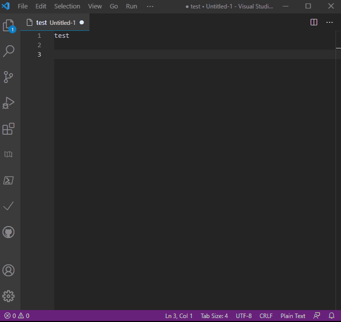

# QuickPckSnippets README
insert a snippet from QuickPick list

## Features

Insert your own snippets from the QuickPick list.



## Usage
Execute ```quickpicksnippets``` command from the Command Palette or the  editor's context menu ([a setting change](#jump) is needed).

## Extension Settings
### Description in ```settings.json```
Add the objects at "quickpicksnippets.snippets"section in your ```settings.json```. Each ofject can have "group","snippet" and "name" keys with corresponding values. In the sample case displayed above, description in ```settings.json``` is as follows:

```
{
...
	"quickpicksnippets.snippets": [
		{
			"snippet": "${CURRENT_DATE}\/${CURRENT_MONTH}\/${CURRENT_YEAR_SHORT}",
			"name": "today"
		},
		{
			"group": "address",
			"snippet": "hoge@hoge.com",
			"name": "email"
		},
		{
			"group": "address",
			"snippet": " <City><Province><Country><ZIP code>",
			"name": "home"
		}
	]
...
}

```

Write your [snippet](https://code.visualstudio.com/docs/editor/userdefinedsnippets) string as a value of "snippet" key. The values of the "name" keys are your snippet names which will be displayed as Quick Pick list items. You can omit this key. In that case, snippet string itself will be displayed instead.

"group" key is also optional. If this key and value are set, the value (i.e. a name of a group) will be displayed as Quick Pick list items. If you select the group, list of names of snippets which belong to the group will be displayed.

### <a name="jump"></a>Adding To Editor Context Menu
If you want to add this command to the editor's context menu, check "Add To Editor Context Menu" in the Settings UI.


## Release Notes
### 1.0.0

First release.

